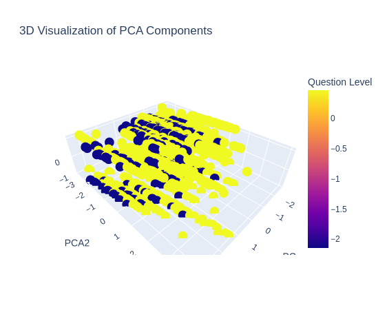

# MathE EDA Project

## Overview

The **MathE Mathematics Learning and Assessment** project provides a comprehensive Exploratory Data Analysis (EDA) of student performance in higher education mathematics. This dataset includes 9,546 records, each representing a student's response to specific mathematical questions. The EDA leverages clustering, dimensionality reduction, and advanced visualizations to uncover meaningful insights about student performance and question difficulty.

---

## Dataset Description

- **Number of Records**: 9,546
- **Features**:
  - `Student Country`: Country of the student.
  - `Question ID`: Identifier for each question.
  - `Question Level`: The difficulty level of the question (Basic/Advanced).
  - `Topic` and `Subtopic`: The mathematical domain and sub-domain of the question.
  - `Keywords`: Important terms associated with the question.
  - `Type of Answer`: Binary indicator of whether the answer was correct (1) or incorrect (0).
  - `PCA1` and `PCA2`: Principal Component Analysis components for dimensionality reduction.

---

## Key Features of the Analysis

### 1. **Exploratory Data Analysis**
- **Univariate Analysis**: Distributions and frequencies of numerical and categorical features.
- **Bivariate and Multivariate Analysis**: Correlation heatmaps, pair plots, and box plots to study relationships between features.

### 2. **Clustering Analysis**
- **K-Means Clustering**:
  - Grouped students based on performance metrics and PCA-reduced dimensions.
  - Identified clusters to understand variations in student capabilities and topic difficulty.

### 3. **Dimensionality Reduction**
- **Principal Component Analysis (PCA)**:
  - Reduced dataset complexity while retaining key information.
  - Visualized clusters and patterns in a simplified 2D space.

### 4. **Visual Insights**
- **Geo-Mapping**:
  - Highlighted student performance trends by country.
- **Sunburst Chart**:
  - Showcased hierarchical relationships between topics, subtopics, and performance.
- **3D Scatter Plot**:
  - Visualized PCA components and clusters in an interactive 3D plot.

---

## Key Insights

1. **Performance Trends**:
   - Students performed better on basic questions compared to advanced ones.
   - Certain topics consistently had higher performance scores, suggesting varying levels of difficulties.

2. **Clustering Insights**:
   - Clusters revealed distinct performance groups, helping identify high and low performers.
   - Advanced-level questions presented challenges for specific student groups.

3. **Dimensionality Reduction**:
   - PCA effectively visualized performance trends and reduced the dataset’s complexity.

4. **Geographical Patterns**:
   - Performance varied significantly across countries, indicating disparities in education systems or resources.

---

## Visual Highlights

### 1. Geo-Mapping


### 2. PCA 3D Scatter Plot


---

## How to Run

### Prerequisites
- Install Python (3.8 or later)
- Install the required libraries:
  ```bash
  pip install -r requirements.txt
## Steps
1. Clone the repository:

    ```bash
    git clone https://github.com/disha-karmakar/MathE-EDA.git
2. Navigate to the project directory:

    ```bash
    cd MathE-EDA
3. Open the Jupyter notebook:

    ```bash
    jupyter notebook MathE_Analysis.ipynb
4. Run all cells to explore the analysis.

### Tools used 
Python, Pandas, Matplotlib, Seaborn, Plotly, and Scikit-learn.

### License
This project is licensed under the MIT License.See the [LICENSE](LICENSE) file for details.


